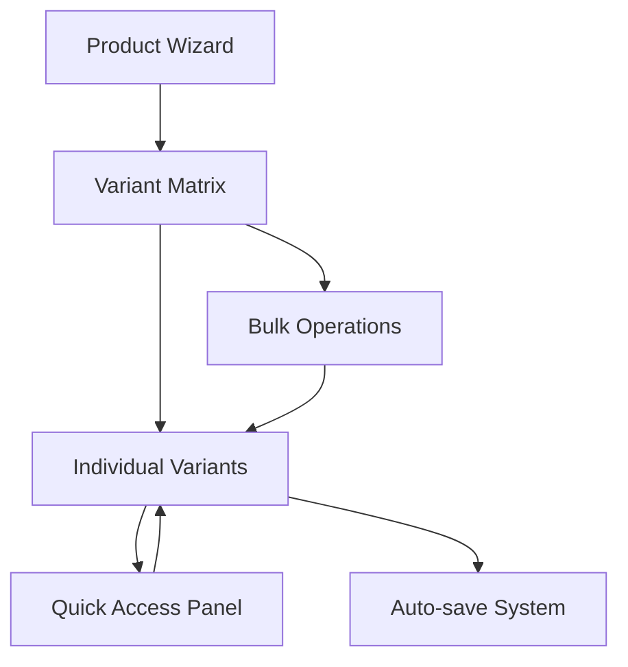

# Developer Handoff Documentation
## E-commerce Product Management System

### Overview
This document provides comprehensive technical documentation for the e-commerce product management system, focusing on product variant inventory controls, streamlined product creation flow, and enhanced OOS (Out of Stock) management.

---

## 📋 Features Implemented

### 1. Streamlined Product Creation Flow
**Location**: `src/components/admin/product/ProductWizard.tsx`

#### Flow Steps:
1. **Basic Info** - Product name, description, category selection
2. **Images** - Product image management 
3. **Variants & Inventory** - Size/color matrix with stock controls
4. **Pricing** - Base pricing and variant overrides
5. **Review & Publish** - Final review before publishing

#### Key Changes:
- ✅ **Removed SEO step entirely** from product creation flow
- ✅ Enhanced variant management with inventory controls
- ✅ Improved navigation and progress tracking
- ✅ Auto-save functionality every 5 seconds

---

### 2. Enhanced Variant Matrix System
**Location**: `src/components/admin/product/EnhancedVariantMatrix.tsx`

#### Core Features:

##### Variant Generation
- **Size × Color Matrix**: Automatically generates all possible combinations
- **Dynamic Addition**: Add/remove sizes and colors on the fly
- **Batch Generation**: Generate variants for multiple size/color combinations

##### Per-Variant Controls
```typescript
interface Variant {
  id: string;
  size: string;
  color: string;
  sku: string;           // Auto-generated or manual
  price: number;         // Base price or override
  stock: number;         // Inventory count
  outOfStock: boolean;   // OOS toggle (independent of stock)
  barcode?: string;      // Optional barcode
  priceOverride?: number; // Optional price override
}
```

##### Bulk Operations
- **Fill Row/Column**: Apply values across size or color variants
- **Set All**: Apply values to all variants
- **Increment/Decrement**: Batch adjust stock levels
- **Clear Selection**: Reset selected variants

##### Advanced Features
- **CSV Import/Export**: Bulk variant management
- **Performance Optimized**: Handles up to 500 variants smoothly
- **Keyboard Navigation**: Arrow keys, Enter to edit, Esc to cancel
- **Real-time Validation**: Unique SKU, non-negative values
- **Auto-save**: Prevents data loss

---

### 3. Variant Quick Access System
**Location**: `src/components/admin/product/VariantQuickAccess.tsx`

#### Quick Access Features:

##### Filtering Options
- **All Variants**: Complete variant list
- **Out of Stock**: OOS variants only
- **Low Stock**: Variants with stock < 5
- **Zero Stock**: Variants with 0 inventory
- **Coming Soon**: Variants with restock dates

##### Bulk Actions
- **Mark OOS**: Set multiple variants as out of stock
- **Mark Available**: Remove OOS status from multiple variants
- **Set Restock Date**: Batch update expected restock dates

##### Per-Variant Controls
- **Stock Adjustment**: Direct stock level editing
- **OOS Toggle**: Quick out-of-stock status changes
- **Restock Date**: Individual restock scheduling

---

## 🏗️ Technical Architecture

### Component Hierarchy
```
ProductWizard (Main Flow)
├── ProductImageManager
├── EnhancedVariantMatrix
│   ├── VariantQuickAccess
│   ├── Bulk Action Controls
│   └── Variant Grid
└── Navigation Controls
```

### State Management
- **Local State**: React useState for component-level state
- **Form State**: React Hook Form for complex forms
- **Auto-save**: Automatic draft saving every 5 seconds
- **Optimistic Updates**: Immediate UI feedback

### Data Flow


---

## 🎨 UI/UX Implementation

### Design System Integration
- **Semantic Tokens**: Uses design system colors from `index.css`
- **Component Variants**: Leverages shadcn/ui component system
- **Responsive Design**: Mobile-first approach with Tailwind CSS
- **Accessibility**: ARIA labels, keyboard navigation, screen reader support

### Key UI Components
- **Progress Indicator**: Step-by-step progress tracking
- **Variant Grid**: Tabular display with inline editing
- **Filter Controls**: Quick variant filtering options
- **Bulk Action Bar**: Multi-select operations interface

---

## 📊 Data Models

### Product Structure
```typescript
interface Product {
  id: string;
  name: string;
  description: string;
  category: string;
  basePrice: number;
  images: ProductImage[];
  variants: Variant[];
  status: 'draft' | 'active' | 'inactive';
  createdAt: Date;
  updatedAt: Date;
}
```

### Variant Structure
```typescript
interface Variant {
  id: string;
  productId: string;
  size: string;
  color: string;
  sku: string;
  price: number;
  stock: number;
  outOfStock: boolean;
  barcode?: string;
  priceOverride?: number;
  restockDate?: Date;
  createdAt: Date;
  updatedAt: Date;
}
```

---

## 🔄 API Integration Points

### Required Endpoints
```typescript
// Product Management
GET    /api/products/:id/variants
PUT    /api/products/:id/variants/bulk
POST   /api/products/:id/variants
PUT    /api/products/:id/variants/:variantId
DELETE /api/products/:id/variants/:variantId

// Inventory Management  
PUT    /api/variants/:id/stock
PUT    /api/variants/:id/oos-status
PUT    /api/variants/bulk/oos-status

// CSV Operations
POST   /api/products/:id/variants/import
GET    /api/products/:id/variants/export
```

### Expected Request/Response Formats
```typescript
// Bulk variant update
PUT /api/products/:id/variants/bulk
{
  variants: [
    {
      id: "variant-1",
      stock: 10,
      outOfStock: false,
      price: 29.99
    }
  ]
}

// OOS status update
PUT /api/variants/:id/oos-status
{
  outOfStock: true,
  restockDate?: "2024-01-15"
}
```

---

## ✅ Validation Rules

### Variant Validation
- **SKU Uniqueness**: No duplicate SKUs within a product
- **Stock Values**: Non-negative integers only
- **Price Values**: Positive numbers with 2 decimal precision
- **OOS Logic**: Can be OOS even with stock > 0
- **Barcode Format**: Valid format when provided

### Business Rules
- **Stock vs OOS**: Warning when stock > 0 but OOS = true
- **Required Fields**: SKU and price are mandatory
- **Size/Color**: Must have at least one size and one color
- **Variant Limit**: Maximum 500 variants per product

---

## 🧪 Testing Strategy

### Unit Tests Required
- **Variant Generation**: Size × Color combinations
- **Bulk Operations**: Multi-variant updates
- **Validation Logic**: SKU uniqueness, stock values
- **CSV Import/Export**: Data transformation
- **OOS Controls**: Status management

### Integration Tests
- **Product Creation Flow**: End-to-end wizard completion
- **Variant Management**: CRUD operations
- **Auto-save**: Draft persistence
- **Quick Access**: Filtering and bulk actions

### Accessibility Tests
- **Keyboard Navigation**: Tab order, shortcuts
- **Screen Reader**: ARIA labels, announcements
- **Color Contrast**: AA compliance
- **Focus Management**: Visible focus states

---

## 🚀 Performance Considerations

### Optimization Strategies
- **Virtual Scrolling**: For large variant lists (>100 items)
- **Debounced Inputs**: Auto-save and validation delays
- **Memoization**: React.memo for expensive renders
- **Lazy Loading**: Import components on demand

### Memory Management
- **Component Cleanup**: useEffect cleanup functions
- **Event Listeners**: Proper removal on unmount
- **Large Lists**: Pagination for 500+ variants

---

## 🔒 Security Considerations

### Client-Side Validation
- **Input Sanitization**: XSS prevention
- **File Upload**: Image type validation
- **CSV Import**: Data validation before processing

### Data Handling
- **Sensitive Data**: No sensitive info in localStorage
- **API Keys**: Environment variable usage
- **User Permissions**: Role-based access control

---

## 📱 Mobile Responsiveness

### Breakpoint Strategy
- **Mobile**: < 768px - Stacked layout, touch-optimized
- **Tablet**: 768px - 1024px - Condensed grid view
- **Desktop**: > 1024px - Full feature set

### Mobile Optimizations
- **Touch Targets**: Minimum 44px touch areas
- **Swipe Gestures**: Horizontal scrolling for tables
- **Modal Sheets**: Mobile-friendly dialogs
- **Keyboard Handling**: Virtual keyboard considerations

---

## 🔮 Future Enhancements

### Planned Features
- **Advanced Analytics**: Variant performance metrics
- **Bulk Image Upload**: Multiple variant images
- **Template System**: Product templates for quick setup
- **Integration APIs**: Third-party inventory systems

### Technical Debt
- **State Management**: Consider Redux for complex state
- **Type Safety**: Strengthen TypeScript interfaces
- **Error Boundaries**: Graceful error handling
- **Monitoring**: Performance and error tracking

---

## 📚 Dependencies

### Core Dependencies
```json
{
  "@radix-ui/react-*": "Latest - UI components",
  "react-hook-form": "^7.61.1 - Form management",
  "lucide-react": "^0.462.0 - Icons",
  "class-variance-authority": "^0.7.1 - Component variants",
  "tailwind-merge": "^2.6.0 - Utility classes"
}
```

### Development Dependencies
- **TypeScript**: Type safety and intellisense
- **ESLint**: Code quality and consistency
- **Prettier**: Code formatting

---

## 🐛 Known Issues & Limitations

### Current Limitations
- **Variant Limit**: 500 variants max (performance constraint)
- **Image Upload**: Limited to standard formats
- **CSV Size**: 10MB upload limit
- **Browser Support**: Modern browsers only (ES2020+)

### Workarounds
- **Large Catalogs**: Use pagination and filtering
- **Legacy Browsers**: Provide graceful degradation
- **File Size**: Compress images before upload

---

## 📖 Documentation Links

### Internal Documentation
- **Component Storybook**: `/docs/components`
- **API Documentation**: `/docs/api`
- **Design System**: `/docs/design-system`

### External Resources
- **React Hook Form**: https://react-hook-form.com/
- **Radix UI**: https://www.radix-ui.com/
- **Tailwind CSS**: https://tailwindcss.com/

---

## 👥 Team Contacts

### Development Team
- **Frontend Lead**: Product management system
- **Backend Lead**: API integration
- **UI/UX Designer**: Design system and interactions
- **QA Lead**: Testing strategy and execution

### Handoff Checklist
- [ ] Code review completed
- [ ] Unit tests passing
- [ ] Integration tests passing
- [ ] Accessibility audit completed
- [ ] Performance benchmarks met
- [ ] Documentation reviewed
- [ ] Deployment ready

---

*Last Updated: December 2024*
*Version: 1.0.0*